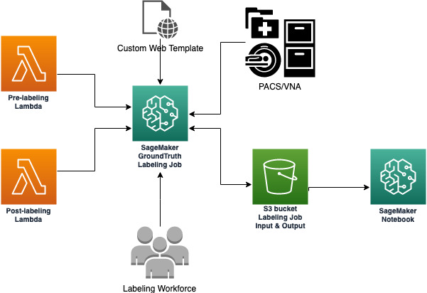
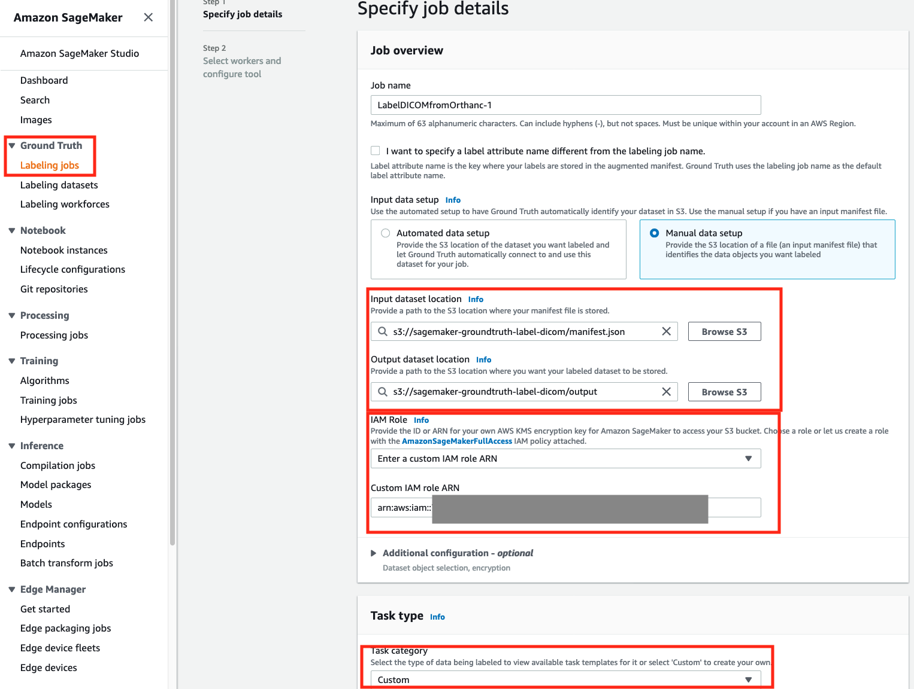
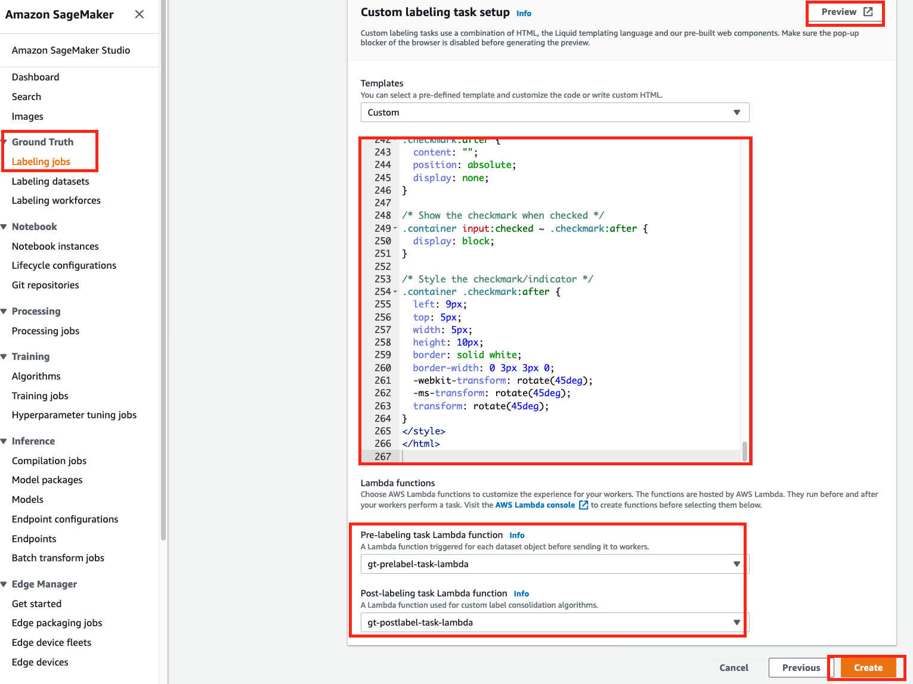
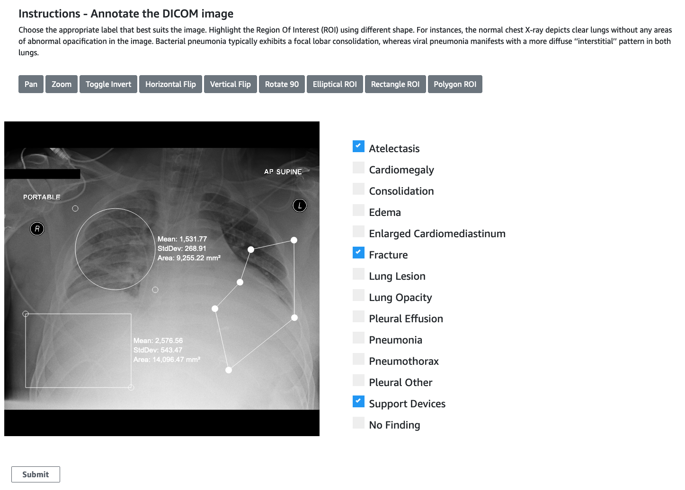
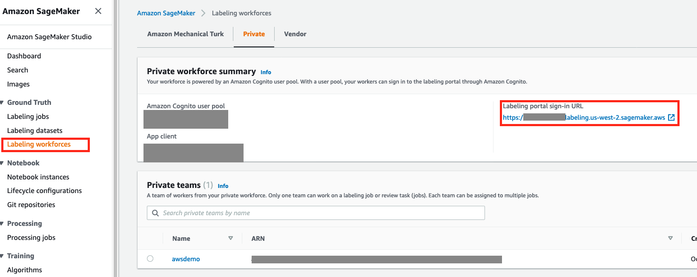

## Annotate Medical Images in DICOM Server and Build ML models using Amazon SageMaker

## Overview Architecture

## Deployment Steps

### Pre-requisite

You will need two public subnets and two private subnets in a given Virtual Private Cloud (VPC). You can either follow this [blog post](https://aws.amazon.com/blogs/database/deploy-an-amazon-aurora-postgresql-db-cluster-with-recommended-best-practices-using-aws-cloudformation/) to deploy the network infrastructure first, or deploy the VPC network infrastructure using this [CloudFormation template](https://docs.aws.amazon.com/codebuild/latest/userguide/cloudformation-vpc-template.html) (Optional)

### Deploy Orthanc DICOM Server on AWS ECS

To deploy the CloudFormation (CFN) on AWS console, using 1-click deployment button:  

The required information will be EC2 Key pair and network infrastructure.

After the CFN stack is successfully created, the Orthanc endpoint URL will be available in the Outputs tab like:  

### Upload DICOM images to Orthanc 

Orthanc supports WADO-RS with its [RESTful API](https://book.orthanc-server.com/users/rest.html). You can upload a DICOM image from local folder:

`curl -u orthanc:orthanc -X POST https://<Orthanc URL>/instances --data-binary @<DICOM Image>.dcm -k`

After uploaded, check the instance id assigned:
`curl -u orthanc:orthanc https://<Orthanc URL>/instances -k`

Then put instance IDs in source field of manifest.json. Assuming here is the output of the previous command (list of DICOM instances):
`[  
   "502b0a4b-5cb43965-7f092716-bd6fe6d6-4f7fc3ce",  
   "af163634-5f8009c8-a941f2a2-4d108bea-119181b5",  
   "3e9562ab-3bd7b304-e003d1f8-0fe2e8f5-e6af3f36"   
]`  
The manifest.json file will look at [this](https://github.com/aws-samples/annotate-medical-images-in-dicom-server-and-build-ml-models-on-amazon-sagemaker/blob/main/sagemaker-groundtruth/manifest.json).

### Deploy the SageMaker Labeling and Notebook Resources

click the button below to deploy lambda functions, S3 bucket, and Notebook instance with appropriate IAM roles:  

Fill the parameter PreLabelLambdaSourceEndpointURL with the Orthanc endpoint URL from previous step.

Take a note of the outputs of CFN deployment, including SMGTLabelingExecutionRole and SageMakerAnnotationS3Bucket names:  

### Create Custom Label Job in SageMaker GroundTruth

- Upload the input manifest.json file generated earlier to the SageMakerAnnotationS3Bucket 
- Create a SageMaker GroundTruth Labeling Job: at step 1 specify the input and output data locations in SageMakerAnnotationS3Bucket plus the SMGTLabelingExecutionRole as IAM role for labeling job
 
- Copy the [content in template.liquid.html](https://github.com/aws-samples/annotate-medical-images-in-dicom-server-and-build-ml-models-on-amazon-sagemaker/blob/main/sagemaker-groundtruth/template.liquid.html) to the Custom Template text field as well as configure the gt-prelabel-task-lambda and gt-postlabel-task-lambda functions deployed earlier.

After configuring the custom labeling task, click on the Preview button, you will see the following preview

If you created a private workforce, you can go to the Labeling Workforces tab and find the annotation console link:  

The annotator will be able to see the task created like:  

### Train and deploy model using SageMaker Notebook Instance

The CFN deployment earlier also create a SageMaker notebook instance, open the Jupyter notebook to train and deploy machine learning models using the annotated datasets from SageMaker GroundTruth labeling job:  

## Security

See [CONTRIBUTING](CONTRIBUTING.md#security-issue-notifications) for more information.

## License

This library is licensed under the MIT-0 License. See the LICENSE file.
