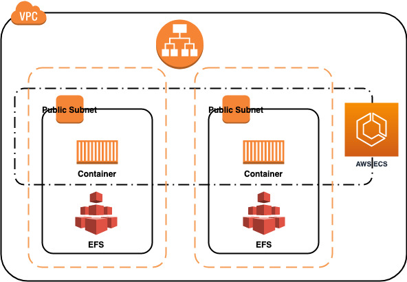

## Orthanc on AWS 

Here is the architecture diagram of default deployment of the Orthanc on AWS:  
 

The single container instance and single DB instance have been tested well with Amazon SageMaker GroundTruth labeling job. 

If you want to build your own container image and push the container image to [Amazon Elastic Container Registry](https://aws.amazon.com/ecr/), run the following script: `./build_and_push.sh`. 

Alternatively, you can build docker container `docker build -t <tag> .` and push it to container repository manually. 

After pushing the container image to ECR, copy the image URI (like <AWS Account ID>.dkr.ecr.<AWS Region>.amazonaws.com/nginx-orthanc-plugins]) that will be used in the Cloudformation deployment.

You can deploy the CloudFormation (CFN) stack on AWS console using `orthanc-ec2-rds-cfn-tempalte.yaml` template in this folder, by filling up the parameters like:   
 

Or you can deploy the CFN stack using AWS CLI:

`aws cloudformation deploy --capabilities CAPABILITY_IAM --template-file ./orthanc-ec2-rds-cfn-tempalte.yaml --stack-name <stackname> --parameter-overrides ConainerImageUrl=<imageURI> KeyName=<EC2 Key> ParameterVPCId=<VPC ID> PrivateSubnet1Id=<Private Subnet in AZ1> PrivateSubnet2Id=<Private Subnet in AZ2> PublicSubnet1Id=<Public Subnet in AZ1> PublicSubnet2Id=<Public Subnet in AZ2> --profile <profilename> ParameterLoadBalancerARN=<LB ARN or Empty value for creating new one> ParameterClusterName=<ECS Cluster Name or Empty value for creating new one>`

You can deploy the High Availability (HA) version of this stack in production:  
 
